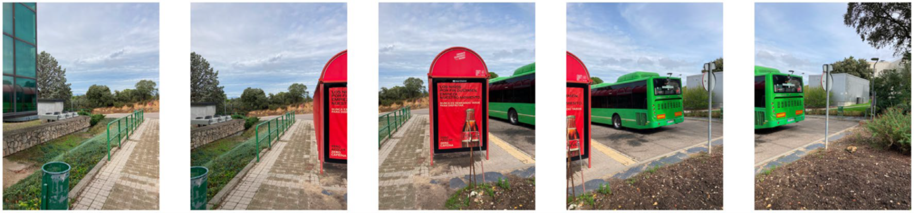
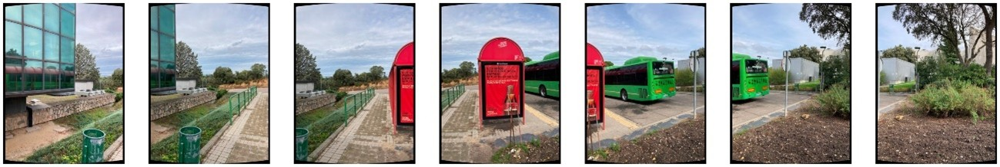
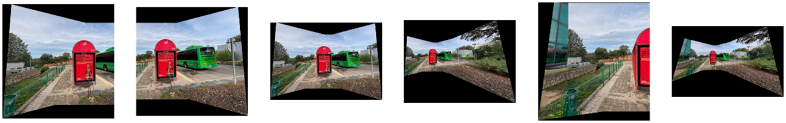
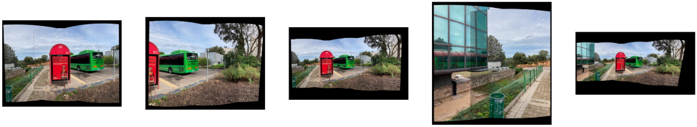

# Proyecto de Creación de Imágenes Panorámicas

Este proyecto genera panorámicas a partir de múltiples imágenes mediante técnicas de emparejamiento de características (SIFT, BF KNN Matcher) y homografía (RANSAC). Incluye la proyección cilíndrica para reducir distorsiones en panorámicas amplias, uniendo imágenes en un formato continuo.

## Descripción

El proyecto se divide en dos partes:

1. **Unión de cinco imágenes**: Genera una panorámica a partir de cinco imágenes. La imagen central se mantiene sin deformar, mientras que las imágenes laterales se ajustan usando homografías para formar una única vista continua.

2. **Unión de siete imágenes con proyección cilíndrica**: Crea una panorámica extendida empleando siete imágenes y proyectándolas en un plano cilíndrico para reducir la distorsión en los bordes. Esta sección introduce una función de proyección cilíndrica, basada en cálculos de distancia focal y coordenadas 3D, antes de la unión de las imágenes.

## Funcionalidades Principales

- **SIFT Detector**: Detecta puntos de interés en las imágenes.
- **BF KNN Matcher**: Encuentra coincidencias entre pares de imágenes usando un enfoque de fuerza bruta.
- **RANSAC Homography**: Calcula la homografía entre imágenes para aplicar la transformación necesaria y unirlas.
- **WarpTwoImages**: Deforma y une dos imágenes, corrigiendo los bordes negros y aplicando transformaciones de perspectiva.
- **Cylinder Image Projection**: Proyecta imágenes en una superficie cilíndrica, útil para panorámicas amplias, con una función específica para ajustar las coordenadas.

## Resultados Parte 1

## Resultados Parte 2

## Requisitos

- Python 3.x
- OpenCV
- NumPy

## Instrucciones de Ejecución

- Se deben tener las 7 imágenes guardadas en una carpeta 'images' a la hora de ejecutar el cuaderno.
- Se le deben pasar las imágenes de izquierda a derecha, siendo la imagen 0 la primera, más a la izquierda, y la imagen 6 la última, más a la derecha. 

## Referencias

- [1] Baumel, L. y Buenaposada José M. (2023). *Fundamentos de Análisis de Imágenes*. UPM. Tema 4. Descripción de Imágenes Digitales.
- [2] Valle, R. (2023). *Fundamentos de Análisis de Imágenes*. UPM. Unit 4. Matching.
- [3] Valle, R. (2023). *Fundamentos de Análisis de Imágenes*. UPM. Unit 3. Feature Selection.
- [4] Royshil. [Función de Warping Cilíndrico](https://gist.github.com/royshil/0b21e8e7c6c1f46a16db66c384742b2b).
- [5] Shapiro, L. [Image Stitching II](https://courses.cs.washington.edu/courses/cse576/17sp/notes/9_ImageStitching2-17.pdf).

